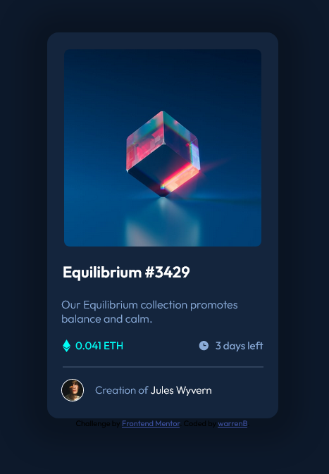

# Frontend Mentor - NFT preview card component solution

This is a solution to the [NFT preview card component challenge on Frontend Mentor](https://www.frontendmentor.io/challenges/nft-preview-card-component-SbdUL_w0U). Frontend Mentor challenges help you improve your coding skills by building realistic projects.

## Table of contents

- [Overview](#overview)
  - [The challenge](#the-challenge)
  - [Screenshot](#screenshot)
  - [Links](#links)
- [My process](#my-process)
  - [Built with](#built-with)
  - [What I learned](#what-i-learned)
  - [Continued development](#continued-development)
  - [Useful resources](#useful-resources)
- [Author](#author)
- [Acknowledgments](#acknowledgments)

**Note: Delete this note and update the table of contents based on what sections you keep.**

## Overview

### The challenge

Users should be able to:

- View the optimal layout depending on their device's screen size
- See hover states for interactive elements

### Screenshot



### Links

- Solution URL: [Solution on Github](https://github.com/warrenbarney/nft-preview-card-component-main)
- Live Site URL: [Live](https://main--dapper-pegasus-428307.netlify.app/)

## My process

### Built with

- HTML5
- CSS
- Flexbox

### What I learned

I learned more about icons, background-images, :hover, gradients and overlays.  

To see how you can add code snippets, see below:

```html
<link rel="icon" type="image/png" sizes="32x32" href="images/favicon-32x32.png">
<!--I learned that this is the info icon in the head section.  Pretty cool.-->
```

```css
.image_overlay {
  display: hidden;
}

.image_overlay:hover {
  width: 280px;
  height: 280px;
  display: flex;
  justify-content: center;
  align-items: center;
  background-color: hsla(178, 100%, 50%, 0.5);
}

.image_overlay svg {
  opacity: 0;
}

.image_overlay svg:hover {
  opacity: 100;
}
/*I discovered more about display: hidden, and opacity... Not sure if this is best practice :P*/
```

### Useful resources

- [Example resource 1](https://www.example.com) - This helped me for XYZ reason. I really liked this pattern and will use it going forward.
- [Example resource 2](https://www.example.com) - This is an amazing article which helped me finally understand XYZ. I'd recommend it to anyone still learning this concept.

**Note: Delete this note and replace the list above with resources that helped you during the challenge. These could come in handy for anyone viewing your solution or for yourself when you look back on this project in the future.**

## Author

- Website - [Add your name here](https://www.your-site.com)
- Frontend Mentor - [@yourusername](https://www.frontendmentor.io/profile/yourusername)
- Twitter - [@yourusername](https://www.twitter.com/yourusername)

**Note: Delete this note and add/remove/edit lines above based on what links you'd like to share.**

## Acknowledgments

This is where you can give a hat tip to anyone who helped you out on this project. Perhaps you worked in a team or got some inspiration from someone else's solution. This is the perfect place to give them some credit.

**Note: Delete this note and edit this section's content as necessary. If you completed this challenge by yourself, feel free to delete this section entirely.**
