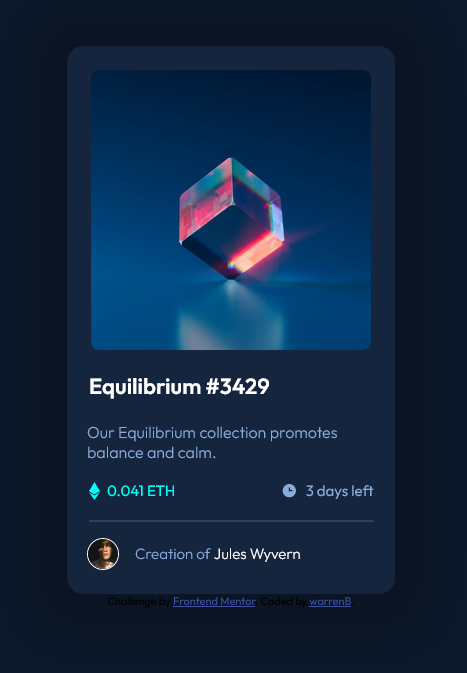

# Frontend Mentor - NFT preview card component solution

This is a solution to the [NFT preview card component challenge on Frontend Mentor](https://www.frontendmentor.io/challenges/nft-preview-card-component-SbdUL_w0U). Frontend Mentor challenges help you improve your coding skills by building realistic projects.

## Table of contents

- [Overview](#overview)
  - [The challenge](#the-challenge)
  - [Screenshot](#screenshot)
  - [Links](#links)
- [My process](#my-process)
  - [Built with](#built-with)
  - [What I learned](#what-i-learned)
  - [Continued development](#continued-development)
  - [Useful resources](#useful-resources)
- [Author](#author)

## Overview

### The challenge

Users should be able to:

- View the optimal layout depending on their device's screen size
- See hover states for interactive elements

### Screenshot



### Links

- Solution URL: [Solution on Github](https://github.com/warrenbarney/nft-preview-card-component-main)
- Live Site URL: [Live](https://main--dapper-pegasus-428307.netlify.app/)

## My process

### Built with

- HTML5
- CSS
- Flexbox

### What I learned

I learned more about icons, background-images, :hover, gradients and overlays.  

```html
<link rel="icon" type="image/png" sizes="32x32" href="images/favicon-32x32.png">
<!--I learned that this is the info icon in the head section.  Pretty cool.-->
```

```css
.image_overlay {
  display: hidden;
}

.image_overlay:hover {
  width: 280px;
  height: 280px;
  display: flex;
  justify-content: center;
  align-items: center;
  background-color: hsla(178, 100%, 50%, 0.5);
}

.image_overlay svg {
  opacity: 0;
}

.image_overlay svg:hover {
  opacity: 100;
}
/*I discovered more about display: hidden, and opacity... Not sure if this is best practice :P*/
```

### Useful resources

- [Flexbox](https://css-tricks.com/snippets/css/a-guide-to-flexbox/) - This is my go to if I forget something Flex related.
- [Fonts](https://fonts.google.com/) - This makes fonts pretty easy.

## Author

- GitHub - [warrenbarney](https://github.com/warrenbarney)
- Frontend Mentor - [@warrenbarney](https://www.frontendmentor.io/profile/warrenbarney)
